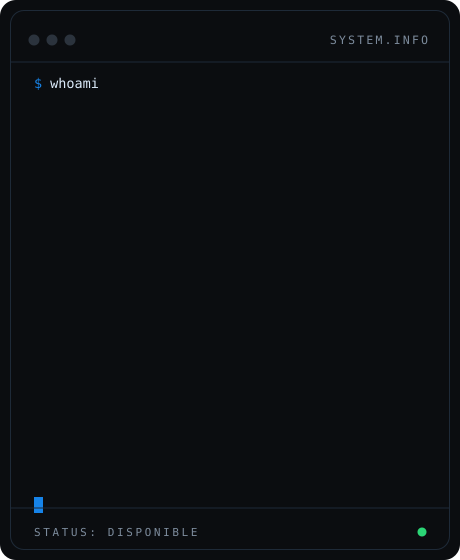

<div align="center">




<br/><br/>

**Convierto procesos manuales en software que trabaja solo.**

Fundador de **ALGORITUM** · Software · AI · Automation

[](https://www.algoritum.com.ar)
[](https://www.linkedin.com/in/benjamin-ordo%C3%B1ez)
[](https://www.instagram.com/algoritum.dev/)
[](https://x.com/Algoritum_dev)
[](mailto:algoritumdev@gmail.com)

</div>

---

### En qué ando

Soy ingeniero en desarrollo de software y trabajo solo: desde la conversación
con el cliente hasta el deploy. Antes pasé cuatro años como controlador de
producción en una multinacional, y ahí aprendí algo que me marcó — la mayoría
de los problemas de un negocio no se resuelven con más tecnología, sino
entendiendo cómo funciona la operación antes de escribir una línea de código.

Hoy construyo sitios, sistemas internos y automatizaciones para negocios que
todavía funcionan con planillas y memoria.

```
Actualmente        Desarrollando ALGORITUM y sus productos
Me interesa        Automatización de procesos e integración de IA en operaciones reales
Trabajo con        TypeScript · Next.js · Node · Apps Script · Gemini API
Hablemos           algoritumdev@gmail.com
```

---

<div align="center">


<br/>


</div>

---

<div align="center">


</div>

---

<div align="center">
<sub>ALGORITUM — Software · AI · Automation · Argentina</sub>
</div>
